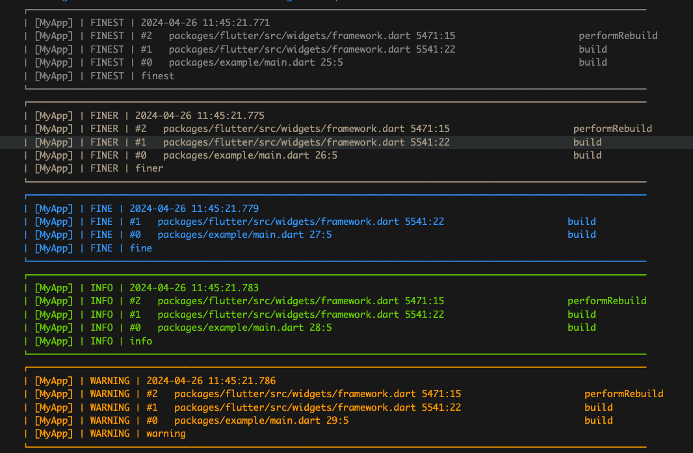
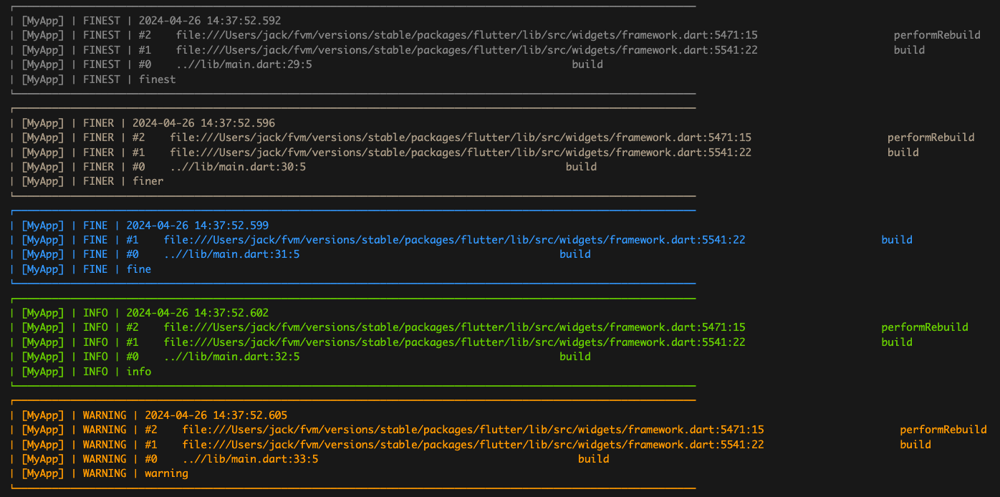
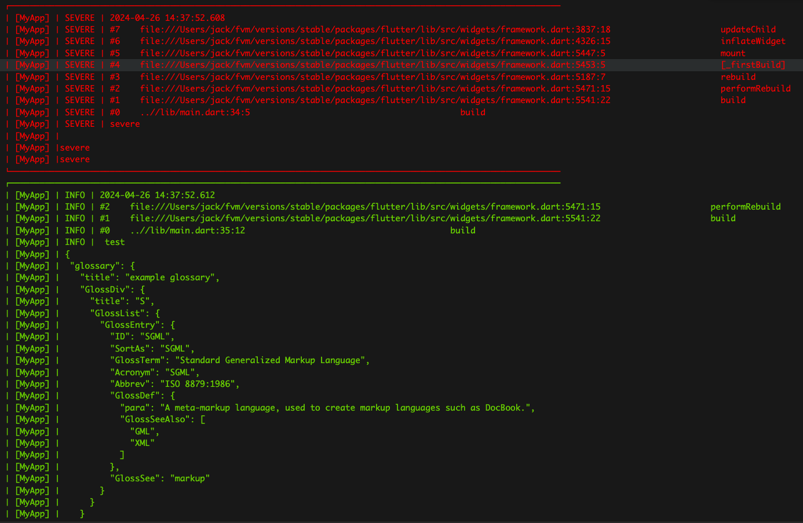

## Color logger

### Do not use stackTracking if use confuse app build
```
   flutter pub add logging
   flutter pub add color_logger
```
#### Show all color
```dart
      AnsiColor.showColor()
```
##### Default color
* [more](lib/src/config/default_config.dart) 
```dart
     final Map<Level, AnsiColor> defaultLevelColors = {
         Level.ALL: AnsiColor.fg(8),
         Level.FINEST: AnsiColor.fg(244),
         Level.FINER: AnsiColor.fg(7),
         Level.FINE: AnsiColor.fg(75),
         Level.INFO: AnsiColor.fg(2),
         Level.WARNING: AnsiColor.fg(214),
         Level.SEVERE: AnsiColor.fg(196),
   };
```

##### Setup
* [more](example/lib/main.dart) 
* Do not use stackTracking if use confuse build
```dart   
   // extension
   // Do not use stackTracking if use confuse build
   Logger.root.level = Level.ALL;
   Logger.root.listenOnColorLogger(
      stackTracking: true,
      kIsWeb: true,
      methodCounts:  {
         Level.SEVERE: 8,
         Level.FINE: 2,
         },
      levelColors: {
         Level.WARNING: AnsiColor.fg(214),
      },
   );

   /// default is true
   Logger.root.listenOnColorLogger();
   or
   Logger.root.listenOnColorLogger(false);


   @override
   Widget build(BuildContext context) {
      logger.finest("finest");
      logger.finer("finer");
      logger.fine("fine");
      logger.info("info");
      logger.warning("warning");
      logger.severe("severe\n\nsevere\nsevere");
      logger.logPrettyMap(
         prefix: 'test',
         arguments: {
         "glossary": {
            "title": "example glossary",
            "GlossDiv": {
               "title": "S",
               "GlossList": {
               "GlossEntry": {
                  "ID": "SGML",
                  "SortAs": "SGML",
                  "GlossTerm": "Standard Generalized Markup Language",
                  "Acronym": "SGML",
                  "Abbrev": "ISO 8879:1986",
                  "GlossDef": {
                     "para":
                        "A meta-markup language, used to create markup languages such as DocBook.",
                     "GlossSeeAlso": ["GML", "XML"]
                  },
                  "GlossSee": "markup"
               }
               }
            }
         }
         },
      );
   }


```
#### Work with vscode extension for help 
* [Vscode extension flutter logger easy life](https://marketplace.visualstudio.com/items?itemName=jackFan.lazy-jack-flutter-logger-easy-life)

* without extension



* with extension you can tap absolute path to code line



